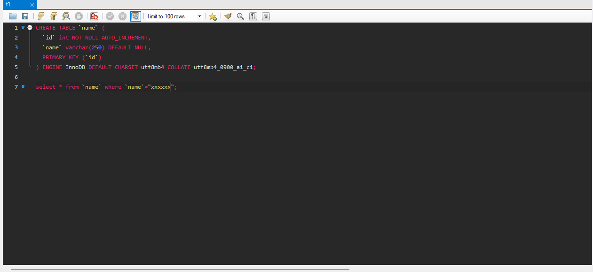

# Mysql Workbench 8 Dark Theme (Editor)

For windows go to 

_C:\Program Files\MySQL\MySQL Workbench 8.0\data\code_editor.xml_

make a backup of the file and replace the content with the content of the file in this repository.

PS : this only changes the editor theme, not the whole workbench theme.

